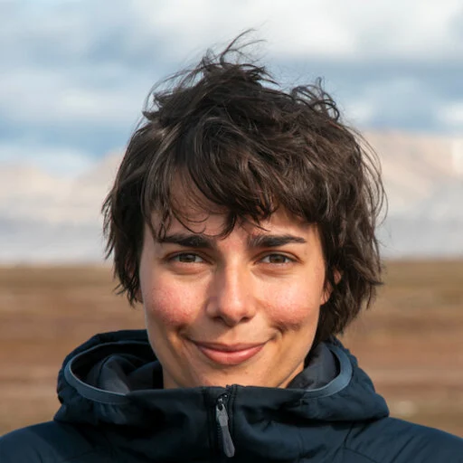

```{=html}
<div class="profile-hero">

  <!-- Profile photo -->
  <div class="profile-photo">
    
  </div>

  <!-- Name, role, affiliations, social links -->
  <div class="profile-info">
    <h1>Sophie E. Weides</h1>
    <p class="profile-role"><i class="bi bi-flower2" style="font-size:0.85em; margin-right:0.35em; vertical-align:-0.05em; opacity:0.8;"></i>PhD Student</p>
    <p class="profile-affil">University of Basel · Zurich–Basel Plant Science Center</p>
    <p class="profile-affil">Basel, Switzerland</p>

    <div class="social-links">

      <!-- Email — Bootstrap Icon -->
      <a class="social-btn email" href="mailto:sophie.weides@gmail.com" title="Email">
        <i class="bi bi-envelope-fill"></i>
        Email
      </a>

      <!-- ORCID — Academicons -->
      <a class="social-btn orcid" href="https://orcid.org/0000-0002-6655-5100"
         target="_blank" rel="noopener" title="ORCID">
        <i class="ai ai-orcid"></i>
        ORCID
      </a>

      <!-- Google Scholar — Academicons -->
      <a class="social-btn scholar"
         href="https://scholar.google.com/citations?hl=en&user=aM0DzFAAAAAJ"
         target="_blank" rel="noopener" title="Google Scholar">
        <i class="ai ai-google-scholar"></i>
        Scholar
      </a>

      <!-- ResearchGate — Academicons -->
      <a class="social-btn rgate" href="https://www.researchgate.net/profile/Sophie-Weides"
         target="_blank" rel="noopener" title="ResearchGate">
        <i class="ai ai-researchgate"></i>
        ResearchGate
      </a>

      <!-- Bluesky — Font Awesome brands -->
      <a class="social-btn bluesky" href="https://bsky.app/profile/sophieweides.bsky.social"
         target="_blank" rel="noopener" title="Bluesky">
        <i class="fa-brands fa-bluesky"></i>
        Bluesky
      </a>

      <!-- GitHub — Bootstrap Icon -->
      <a class="social-btn github" href="https://github.com/sweides"
         target="_blank" rel="noopener" title="GitHub">
        <i class="bi bi-github"></i>
        GitHub
      </a>

    </div><!-- /.social-links -->
  </div><!-- /.profile-info -->
</div><!-- /.profile-hero -->
```

## <svg class="section-icon-svg" xmlns="http://www.w3.org/2000/svg" viewBox="0 0 24 24" fill="none" stroke="currentColor" stroke-width="2" stroke-linecap="round" stroke-linejoin="round" aria-hidden="true"><path d="M11 20A7 7 0 0 1 9.8 6.1C15.5 5 17 4.48 19 2c1 2 2 4.18 2 8 0 5.5-4.78 10-10 10z"/><path d="M2 21c0-3 1.85-5.36 5.08-6C9.5 14.52 12 13 13 12"/></svg> Research

I study how alpine and arctic plants respond to climate change, so which species are moving upslope, which are not, and what happens to plant communities because of these shifts. My PhD at the University of Basel takes a European-scale view of this by combining resurveyed historical vegetation plots all across Europe to which I added with my fieldwork in Norway and Svalbard.

Before Basel I spent five years at the University of Tübingen doing my Bachelor and Master. During my thesis I asked a different kind of question: where, exactly, do grassland plants get their water from? Using stable isotopes, I traced roots to their water sources and found that plants partition the soil more reliably than drought models tend to assume.

```{=html}
<div class="tag-list">
  <span class="tag">Alpine ecology</span>
  <span class="tag">Climate change biology</span>
  <span class="tag">Vegetation dynamics</span>
  <span class="tag">Elevational range shifts</span>
  <span class="tag">Plant community ecology</span>
  <span class="tag">Biogeography</span>
  <span class="tag">Functional traits</span>
  <span class="tag">Belowground ecology</span>
</div>
```

---

## <i class="bi bi-journal-bookmark-fill section-icon" aria-hidden="true"></i> Selected publications

```{=html}
<div class="pub-entry">
  <div class="pub-title">On the limits of alpine plants: a systematic review of the factors behind species' elevational range limits</div>
  <div class="pub-authors"><strong>Sophie E. Weides</strong>, John-Arvid Grytnes, Stefan Dullinger, Jonathan Lenoir, L. Camila Pacheco-Riaño, John R. Pannell, Sonja Wipf &amp; Sabine B. Rumpf</div>
  <div class="pub-meta">
    <span class="pub-journal">Ecology and Evolution, 2026</span>
    <span class="pub-badge badge-published">Published</span>
    <a class="pub-doi" href="https://doi.org/10.1002/ece3.73183" target="_blank">doi.org/10.1002/ece3.73183</a>
  </div>
</div>

<div class="pub-entry">
  <div class="pub-title">Belowground niche partitioning is maintained under extreme drought</div>
  <div class="pub-authors"><strong>Sophie E. Weides</strong>, Tomáš Hájek, Pierre Liancourt, Maximiliane M. Herberich, Rosa E. Kramp, Sara Tomiolo, L. Camila Pacheco-Riaño, Katja Tielbörger &amp; Maria Májeková</div>
  <div class="pub-meta">
    <span class="pub-journal">Ecology, 2024</span>
    <span class="pub-badge badge-published">Published</span>
    <a class="pub-doi" href="https://doi.org/10.1002/ecy.4198" target="_blank">doi.org/10.1002/ecy.4198</a>
  </div>
</div>
```

→ [All publications](publications.qmd)

